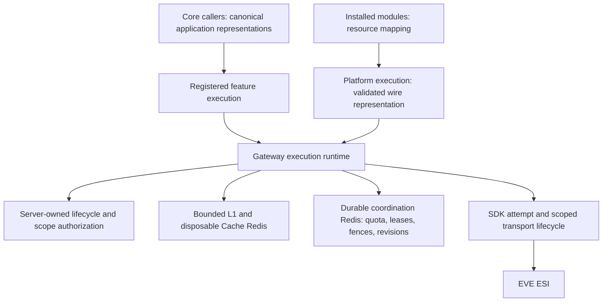

# ESI gateway architecture evaluation

The architecture is sound in its main boundaries, but its invalidation and shutdown contracts need correction. Retain the gateway and its public interfaces. Two reproduced invalidation failures are the highest priorities; a reproduced lease-renewal drain failure follows. Passing structural checks and the existing unit suite do not cover these combinations.

## Scope and evidence

- Date: 2026-10-03. Commit: `35bf357129965cbf18751d290bc0b29f1a6c5fe7`, plus the current working tree.
- Audience: the user's own engineering decision-making, as requested.
- Reviewed: `api/src/esi-gateway`, its public interfaces and internal execution paths, gateway dependency and egress verifiers, relevant architecture guidance, current ESI specifications, and archived deepening, Effect-lifecycle, and rate-admission designs. Wallet and mail mounts were sampled to establish the caller boundary.
- The working tree already contained substantial unrelated work, including changes to gateway guidance. Existing files were preserved. This evaluation makes no production implementation changes.
- Three independent BMad reviewer lenses covered the architecture rubric, adversarial consistency, and reconciliation with current code. Their full findings are in [reviews/](reviews/).
- GitNexus reported an index three commits behind HEAD. A concept query returned malformed symbol/path data, and an exact symbol context lookup failed. Refresh attempts failed with `ERR_PNPM_IGNORED_BUILDS`. No codebase-memory coverage tool was exposed. Material findings use exact source and behavioral probes; there is no complete graph or absence-of-defects claim.
- BMad's project configuration/memory scripts and `uv` were unavailable. This is a validation report using the installed skill, not a newly created architecture spine or a repaired BMad installation.

## Architecture assessment

The implemented paradigm is **ports and adapters behind a policy-owning gateway**. Features declare a representation and call a small typed Promise interface; the gateway owns protocol binding, token resolution, caching, retries, quota admission, coordination, and lifecycle. The SDK owns one typed protocol attempt.

| Dimension               | Assessment                                                                                                                                                                                                      |
| ----------------------- | --------------------------------------------------------------------------------------------------------------------------------------------------------------------------------------------------------------- |
| Public interface depth  | Strong. Factories hide registration order, credentials, transport and cache machinery. Read results expose intentional freshness and failure metadata.                                                          |
| Ownership               | Strong. Application authorization remains with callers; gateway credential checks do not infer ownership from a character ID. SDK protocol facts and application policy have different owners.                  |
| Dependency direction    | Explicit and mechanically checked. Pure/support, infrastructure, execution and observability responsibilities have an allowlist and cycle checks.                                                               |
| Representation identity | Names, versions, normalized inputs, authorization lifecycles/generations and resource revisions have identifiable owners. Core canonical and platform wire representations remain distinct.                     |
| State and invalidation  | Requires correction. The mutation cancellation and repair-marker failures below break the intended convergence after external mutations.                                                                        |
| Lifecycle               | Upstream permits span body consumption and metadata observation. Cache-collapse lease renewals have a separate drain gap.                                                                                       |
| Operations              | Redis roles, namespace recovery, conservative coordination degradation, telemetry, shutdown order and capacity guidance are documented. Distributed deployment behavior was not exercised in this review.       |
| Technology fit          | Ratified against this checkout: SDK 3.1.0 and pinned Effect 4.0.0-rc.115. Effect remains confined to the internal attempt lifecycle. No new technology binding, upgrade or claim about latest releases is made. |

The 1,560-line execution runtime concentrates substantial orchestration, but file size alone does not justify another public seam or a broad rewrite. Correct the identified contracts first. Any later extraction should isolate a cohesive internal lifecycle or cache behavior while preserving one execution owner.

## Findings

### F1 — HIGH — Cancellation can suppress invalidation after an uncertain mutation

**Trigger:** a caller aborts after a mutation dispatches, and the upstream response fails. The external mutation may already have applied.

Mutation dispatch deliberately ignores post-dispatch caller cancellation (`api/src/esi-gateway/internal/execution-runtime.ts:589`). However, the surrounding retry catch checks the caller signal before preserving the SDK failure (`:1166`). The raw abort reason replaces the uncertain transport error, so `shouldAdvanceRevisionAfterMutationError` no longer recognizes an unknown mutation outcome (`internal/failure-policy.ts:149`). The mailbox revision can remain unchanged.

**Observed:** the temporary registered-interface probe returned the caller's cancellation error and made zero revision increments after a dispatched transport failure. This proves suppression of invalidation, not whether a real ESI mutation applied.

**Expected:** once dispatched, preserve outcome classification long enough to invalidate on uncertain completion, then apply the caller-facing cancellation policy.

**Smallest correction:** separate pre-dispatch cancellation from post-dispatch mutation settlement; do not replace the outcome used for revision decisions with an abort reason. Add regression coverage for abort combined with timeout/response failure, retaining the existing successful-after-abort behavior.

### F2 — HIGH — Recovery of mutation revisions depends on disposable cache state

**Trigger:** ESI confirms a mutation, coordination revision advancement fails, and the disposable repair marker is subsequently lost while another runtime retains pre-mutation L1 data.

`EsiResourceRevisionRegistry.advance` records a failed advance in a local set and Cache Redis (`api/src/esi-gateway/internal/resource-revision.ts:106`). Another runtime decides repair is needed using its own local set and that disposable marker (`:118`). If the marker disappears, a successful read of the old coordination revision allows its old L1 envelope to remain compatible.

**Observed:** a two-runtime probe warmed a reader, completed a 204 mutation whose revision increment failed, cleared the disposable marker, and obtained the reader's pre-mutation L1 result with revision zero and no repair.

**Expected:** losing disposable state cannot make an unresolved external mutation look reconciled. This concerns data invalidation; the probe did not demonstrate an authorization bypass.

**Smallest correction:** give revision-repair intent a durable owner and an explicit recovery/admission contract. Merely moving a best-effort write onto the same unreachable Redis is insufficient: establish durable intent before dispatch, or otherwise keep revision-sensitive reads gated until recovery can prove convergence. Preserve disposable-cache loss as a safe miss.

### F3 — MEDIUM — Runtime shutdown does not join issued cache-lease renewals

`#renewLease` schedules fire-and-forget asynchronous renewals (`api/src/esi-gateway/internal/execution-runtime.ts:1266`). The request finalizer stops the timer and releases the lease, but does not join an already issued renewal (`:1117`). `close()` waits for tracked operations, so it can finish before that renewal settles (`:1443`). This differs from the carefully supervised upstream-permit lifecycle.

**Observed:** the probe held an issued request-lease renewal pending and saw runtime closure resolve before settling it.

**Expected:** closing the gateway drains accepted work that may still use process-owned dependencies, including issued coordination commands.

**Smallest correction:** serialize renewal, retain the issued promise, stop further scheduling, and await settlement before release and operation completion. Keep request-collapse lease lifetime distinct from upstream concurrency permit lifetime.

### F4 — MEDIUM — The documented exclusive execution-path rule contradicts required dual registrations

The gateway guide requires exactly one path per operation (`api/src/esi-gateway/AGENTS.md:29`). The egress verifier deliberately requires both core callable and platform registrations for ten operations (`scripts/verify-esi-egress.mjs:15`, `:94`). The catalog initializer's comment also promises exclusivity (`api/src/esi-gateway/catalog-interface.ts:177`).

Two independently built callers can follow incompatible instructions: one removes a registration to satisfy the prose, while another retains it to satisfy verification. This is a contract defect; it does not demonstrate duplicate network dispatch or a cache collision.

**Smallest correction:** document one selected execution path per representation/invocation, with reviewed shared operations allowed distinct canonical core and platform wire representations. Link to the allowlist and identify version ownership. Preserve archived designs as history rather than removing working registrations to satisfy stale wording.

### F5 — MEDIUM — The egress verifier misses ordinary raw-fetch patterns

The direct-fetch detector checks a callee named `fetch` and a directly literal ESI URL (`scripts/verify-esi-egress.mjs:786`). Its actual fixture behavior rejects a literal direct fetch but accepts both a same-file URL constant and an alias of `globalThis.fetch`.

**Observed:** disposable fixtures ran through the real verifier; the two bypass forms exited zero. No network requests occurred and no production bypass was established.

**Smallest correction:** resolve ordinary local URL constants and fetch aliases using the existing AST machinery, with focused rejection fixtures. Document remaining dynamic limitations. A green verifier is evidence for its checked patterns, not proof of all possible egress.

## Contract follow-ups and recommendations

- **MEDIUM, acknowledged spec conflict:** cached wallet results return empty quota, while `openspec/specs/esi-resilience/spec.md:257` requires the captured quota snapshot. `openspec/changes/archive/2026-09-12-deepen-esi-module-interface/reconciliation.md:31` explicitly deferred this discrepancy. Decide whether to adopt empty cached quota in the active spec or make a separate envelope change. Historical quota must remain descriptive and must not become admission state.
- **LOW, provenance gap:** `docs/organization-platform.md:184` records SDK 3.0.1; the current SDK is 3.1.0. Later core metadata review dates do not clearly link that organization's review to the current generated facts. Reconcile provenance without inventing a live endpoint review.
- **LOW, evolution guidance:** a feature mapper/schema change requires an operation-catalog representation-version bump; the factory has no independent version field. Document that owner and its effect on shared platform caches. Independent versioning is a future choice only if independent evolution becomes necessary.

## Fetching compliance evidence

This is a gateway architecture assessment, not a complete browser-to-ESI or organization admission audit. Frontend queries, SSR, restored browser presentation and module admission graphs are outside scope. The sampled mounts establish where ownership is checked; they do not certify every caller.

| Path / interface                                            | Identity and execution                                                             | Mounted authorization / mapping                                                                                                                                   |
| ----------------------------------------------------------- | ---------------------------------------------------------------------------------- | ----------------------------------------------------------------------------------------------------------------------------------------------------------------- |
| `GET /api/me/characters/:characterId/wallet`                | Character and lifecycle; `wallet-balance-core` registered read                     | Root mount `api/src/index.ts:75`; parameter validation, session and owned-character middleware in `api/src/characters/finance-routes.ts:50`                       |
| Mail mutations under `/api/me/characters/:characterId/mail` | Character/lifecycle and mutation inputs; registered mutation with mailbox revision | Root mount `api/src/index.ts:76`; route-owned validation/session/ownership; the probe calls the gateway directly to isolate post-admission behavior               |
| `executePlatformEsiOperation`                               | Catalog-validated inputs and explicit public or character-lifecycle binding        | Gateway verifies scope/generation; platform callers own resource admission and mapping after validated wire-cache retrieval. Full module routes were not audited. |

| Check IDs                         | Result                                                             | Evidence and limit                                                                                                                         |
| --------------------------------- | ------------------------------------------------------------------ | ------------------------------------------------------------------------------------------------------------------------------------------ |
| MOD-01–04                         | PASS within gateway scope                                          | Public seams, representation registration, SDK binding and interface tests; browser consumers not evaluated                                |
| MOD-05                            | N/A                                                                | Browser query-persistence interface is outside scope                                                                                       |
| MOD-06                            | BLOCKED for exhaustive claim                                       | Dependency checks pass; no exhaustive helper/type duplication audit                                                                        |
| AUTH-04                           | PASS for sampled wallet mount                                      | Validation/session/owned-character ordering; gateway scope/lifecycle rechecks                                                              |
| AUTH-01–03, AUTH-05–07            | N/A to full compliance certification                               | Browser execution, organization authority and presentation gates not audited                                                               |
| QUERY-01, QUERY-04                | PASS within gateway scope                                          | Registered identity, schemas and representation tests; no browser key/contract certification                                               |
| QUERY-06                          | FAIL                                                               | F1 and F2 reproduce broken mutation invalidation                                                                                           |
| Other QUERY checks; PERSIST-01–10 | N/A                                                                | Browser result retention and application DTO transport are outside scope                                                                   |
| TIME-01, TIME-02, TIME-05         | PASS for covered gateway cases                                     | Freshness, conditional 304, generation-bound private stale and failure-policy unit tests pass                                              |
| TIME-03–04, TIME-06–07            | N/A                                                                | Browser restoration, presentation and refresh scheduling are outside scope                                                                 |
| ESI-01                            | BLOCKED for complete review provenance                             | Local registration consistency checks pass; the organization SDK review link remains unresolved, and no live endpoint review was performed |
| ESI-02                            | PASS for local consistency                                         | Compatibility/validation ownership and narrow bloodlines exception; no live endpoint review                                                |
| ESI-03                            | FAIL; distributed execution BLOCKED                                | F2 exposes disposable repair state; real Redis integration was not run                                                                     |
| ESI-04                            | PASS for covered cases                                             | Identity, malformed envelope, generation, fence and waiter unit scenarios pass; no complete distributed claim                              |
| ESI-05                            | PASS for covered SDK/permit cases                                  | Permit/body/deadline tests pass. F3 separately fails the broader runtime-close contract for cache-collapse leases                          |
| ESI-06–07                         | PASS for existing unit scenarios, with F1 qualification            | Pacing/cooldown/retry tests pass; mutation failure classification needs correction                                                         |
| ESI-08–09                         | N/A                                                                | Pagination collectors and name-resolution orchestration are outside scope                                                                  |
| ESI-10                            | PASS for existing secrecy/failure scenarios, with F1 qualification | Interface secrecy/redaction/failure tests pass; post-dispatch cancellation loses useful classification                                     |

PASS means only the stated scope and evidence. It does not extend to distributed deployments or unreviewed callers.

## Verification

| Exact command / check                                                                        | Result                             | Evidence                                                                                                               |
| -------------------------------------------------------------------------------------------- | ---------------------------------- | ---------------------------------------------------------------------------------------------------------------------- |
| `pnpm exec node scripts/verify-esi-egress.mjs`                                               | Exit 0 on current source           | [runner log](evidence/egress.log.txt); F5 separately probes limitations                                                |
| `pnpm exec tsx scripts/verify-esi-gateway-boundaries.ts`                                     | Exit 0                             | [runner log](evidence/boundaries.log.txt)                                                                              |
| `pnpm --filter @eve-space/api test tests/esi-gateway`                                        | Exit 0; 31 files, 365 tests passed | [runner log](evidence/tests.log.txt)                                                                                   |
| `pnpm --filter @eve-space/api test tests/esi-gateway/architecture-adversarial-probe.test.ts` | Exit 0; 3 probes reproduced F1–F3  | Temporary repository test removed; reproduction source retained in [evidence/](evidence/)                              |
| Installed `lint_spine.py` applied to `docs/architecture.md`                                  | Zero mechanical findings           | Existing prose has no AD blocks; this is not proof of decision completeness                                            |
| Three independent reviewers                                                                  | Complete                           | [Rubric](reviews/review-rubric.md), [adversarial](reviews/review-adversarial.md), [reality](reviews/review-reality.md) |
| GitNexus refresh                                                                             | Unsuccessful                       | [runner log](evidence/index.log.txt); stale/malformed graph evidence excluded                                          |
| Real Redis integration, deployment probes, live ESI                                          | Not run                            | Distributed/runtime certification remains blocked; no deployment or dependency behavior was changed                    |

The behavioral probes use controlled adapters, not production EVE accounts or network mutations. Their passing assertions demonstrate the reported failures and must be changed into desired-behavior regressions when implementing corrections.

## Recommended next work

Use `bmad-spec` to reconcile the execution-path, mutation-settlement and durable-repair contracts with the active specs, keeping established ownership intact. Then create bounded implementation tickets with `bmad-ticket`: first F1/F2 invalidation, then F3 renewal drain, followed by F4/F5 contract and enforcement corrections. The cached-quota and version-provenance choices can be separate follow-ups.

No broad gateway replacement, dependency upgrade or new public executor abstraction is justified by this evaluation.
